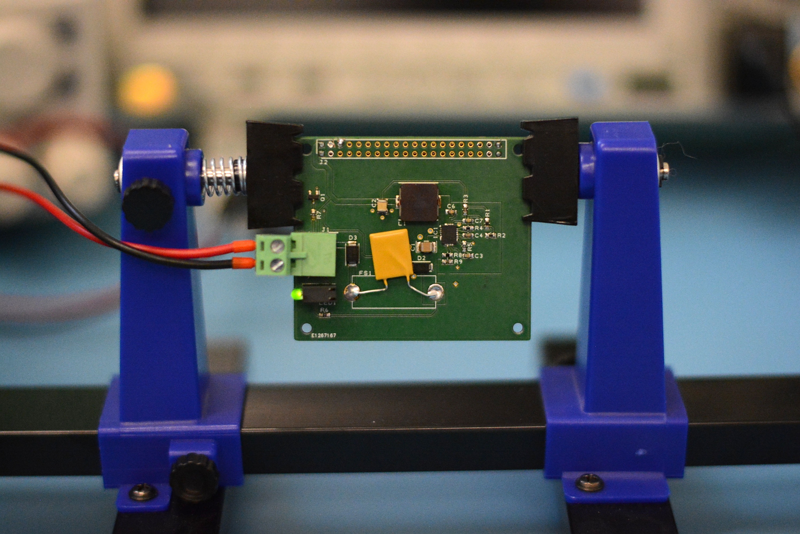

# RS Raspberry Pi Industrial Power Supply

The files in this repository are the files necessary to construct a 9-30Vdc input, 5.1Vdc 2.5A output switch-mode power supply suitable for plugging into a Raspberry Pi computer.

## Purpose

These files are being published to support a series of DesignSpark posts detailing the development of a SMPS circuit using Maxim EE-Sim OASIS.

## Contents

The directory structure is as follows

| Folder | Description |
| ------ | ----------- |
| `design/` | Contains the DesignSpark PCB design files |
| `design/output/` | Contains the manufacturing data produced from DesignSpark PCB |
| `simulation/` | Contains the simulation files for Maxim EE-Sim OASIS |

## Notes

This project is for a Raspberry Pi switch-mode power supply that outputs 5.1Vdc at up to 2.5A from a 9-30Vdc input.

The design has been done in DesignSpark PCB, and Gerbers are supplied for manufacturing.